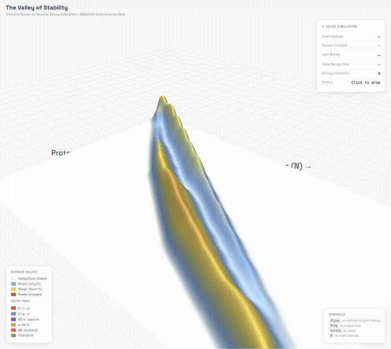

# Kinetic Valley: Physical & Digital Visualization of Nuclear Stability


## 1. Project Overview

This project provides a multi-modal visualization of the "Valley of Stability"—a topographic representation of nuclear binding energy. It consists of two components:

1. **Physical Artifact:** A 3D-printable model generated from AME2020 data, optimized for FDM manufacturing on Bambu Lab printers.
2. **Digital Twin:** An interactive HTML5/WebGL simulation that allows users to simulate nuclear decay chains by "dropping" neutrons down the energy landscape.



## 2. Repository Structure

| File | Description |
| --- | --- |
| `valley_smoothed.py` | **Source Code.** Python script that fetches IAEA data, calculates topography, applies Gaussian smoothing, and exports the STL mesh. |
| `valley_simulation.html` | **Interactive Simulation.** Web application to visualize decay chains (requires local server). |
| `valley_data.json` | **Terrain Data.** Pre-computed height map for the web simulation. |
| `data_gen.py` | **Data Generator.** Python script to regenerate `valley_data.json` from AME2020 data. |
| `kinetic_valley_smoothed.3mf` | **Manufacturing File (Preferred).** Bambu Studio project file with pre-configured color painting. |
| `kinetic_valley_smoothed.stl` | **Raw Geometry.** The watertight mesh file for use in other slicers. |
| `requirements.txt` | **Dependencies.** Python libraries required to run the generation scripts. |
| `BambuStudio.conf.2` | **Config.** Exported Bambu Studio environment settings. |

## 3. Prerequisites & Installation

### Python Environment

To regenerate the mesh or process new data, you need Python 3.8+ and the dependencies listed in `requirements.txt`.

**Installation:**

```bash
pip install -r requirements.txt
```

### Web Simulation Requirements

The simulation requires a **local web server** due to browser security restrictions on loading local JSON files.

## 4. Usage Guide

### A. Running the Simulation (Digital Twin)

⚠️ **Important:** The simulation cannot be opened by double-clicking the HTML file. You must run a local server:

**Option 1: Python HTTP Server (Recommended)**
```bash
cd /path/to/valley_stability
python3 -m http.server 8080
```
Then open your browser to: **http://localhost:8080/valley_simulation.html**

**Option 2: VS Code Live Server**
- Install the "Live Server" extension
- Right-click `valley_simulation.html` → "Open with Live Server"

**Controls:**

| Action | Description |
| --- | --- |
| **Click** | Drop a "neutron marble" on any isotope to start a decay chain |
| **Hover** | View isotope details: Name, Z, N, Mass Number, Half-Life, Binding Energy |
| **Drag** | Rotate the 3D view |
| **Scroll** | Zoom in/out |
| **R key** | Reset camera to default position |

### Decay Simulation Features

The simulation accurately models **nuclear decay physics**:

| Decay Mode | Color | Description |
| --- | --- | --- |
| **β⁻** | 🔴 Red | Neutron → Proton (neutron-rich isotopes) |
| **β⁺** | 🔵 Blue | Proton → Neutron (light proton-rich isotopes) |
| **EC** | 🟣 Purple | Electron Capture (heavy proton-rich isotopes) |
| **α** | 🟠 Orange | Alpha emission (heavy nuclei, Z > 82) |
| **ββ** | 🟧 Deep Orange | Double-beta decay (rare, even-even nuclei) |

**Physics Accuracy:**
- Decays only occur if **energetically favorable** (downhill in binding energy)
- The simulation correctly handles special cases like **Mo-100** (stable against single β⁻ to Tc-100)
- Half-lives are displayed in appropriate units (ps → ns → μs → ms → s → days → years → Gyr)

### B. Manufacturing the Object (Physical Artifact)

For the best results, use the provided `.3mf` file, which contains all color mapping and process tweaks.

1. **Open Project:** Double-click `kinetic_valley_smoothed.3mf` to open in Bambu Studio.
2. **Verify Settings:**
   * **Printer:** Bambu Lab X1 Carbon (0.4mm Nozzle).
   * **Filament Mapping:**
     * Slot 1: **Black/Grey** (Grid/Base)
     * Slot 2: **Blue** (Stable Valley Floor)
     * Slot 3: **Yellow** (Unstable Slope)
     * Slot 4: **Red** (Drip Line/Peaks)
3. **Slice & Print:** The file includes a Prime Tower and "Flush Volumes" auto-calculated to prevent color bleeding.

### C. Regenerating the Geometry (Source Code)

If you wish to modify the smoothing parameters or update the data source:

**For the 3D Model:**
```bash
python valley_smoothed.py
```
This will fetch the latest `mass_1.mas20.txt` from the IAEA and overwrite `kinetic_valley_smoothed.stl`.

**For the Web Simulation Data:**
```bash
python data_gen.py
```
This regenerates `valley_data.json` with the same terrain calculations used for the STL.

## 5. Methodology

### Data Processing

Data is sourced from the **AME2020 Atomic Mass Evaluation** (IAEA).

* **X-Axis:** Neutron count (N)
* **Y-Axis:** Proton count (Z)  
* **Z-Axis (Height):** Represents nuclear instability

**Height Calculation:**
$$Height = (8.8 \text{ MeV} - \text{BE/nucleon})^2 + 2.0 \times \text{DistanceFromValleyCenter}$$

This creates a "gravity well" where:
- **Stable isotopes** are at the bottom of the valley (Fe-56 region)
- **Unstable isotopes** form the walls and peaks
- The **drip lines** (neutron/proton limits) form the valley edges

**Smoothing:** A Gaussian filter (σ=3.0) is applied to ensure the geometry is manifold and printable.

## 6. Manufacturing Validation

To ensure the model is ready for physical production, the design was validated using Bambu Studio:


* **White**: Stable Valley Floor (highest binding energy per nucleon)
* **Blue**: Low Slope / Long Half-Life isotopes
* **Yellow**: High Slope / Short Half-Life isotopes
* **Red**: Peaks / Extreme Instability (drip lines)

## 7. Troubleshooting

| Issue | Solution |
| --- | --- |
| "Error loading data" when opening HTML | Run `python3 -m http.server 8080` and access via `localhost:8080` |
| Simulation shows wrong decay direction | The terrain height determines decay direction; some edge cases may differ from textbook chains |
| STL has holes or is non-manifold | Re-run `valley_smoothed.py`; the Gaussian smoothing ensures watertight geometry |
| Colors don't match print preview | Verify filament slot assignments in Bambu Studio match the color legend |
