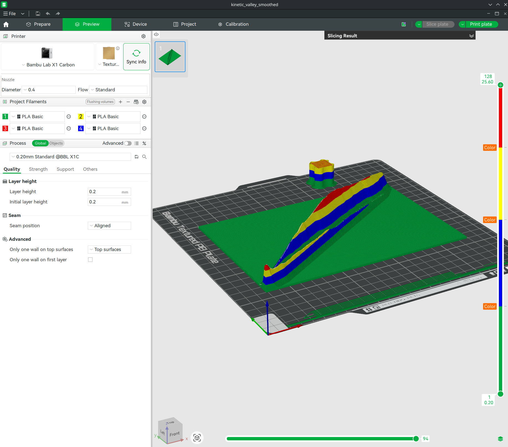

# Kinetic Valley: Physical & Digital Visualization of Nuclear Stability


## 1. Project Overview

This project provides a multi-modal visualization of the "Valley of Stability"—a topographic representation of nuclear binding energy. It consists of two components:

1. **Physical Artifact:** A 3D-printable model generated from AME2020 data, optimized for FDM manufacturing on Bambu Lab printers.
2. **Digital Twin:** An interactive HTML5/WebGL simulation that allows users to simulate nuclear decay chains by "rolling" neutrons down the energy landscape.

## 2. Repository Structure

| File | Description |
| --- | --- |
| `valley_smoothed.py` | **Source Code.** Python script that fetches IAEA data, calculates topography, applies Gaussian smoothing, and exports the STL mesh. |
| `valley_simulation.html` | **Interactive Simulation.** Standalone web application to visualize decay chains. |
| `kinetic_valley_smoothed.3mf` | **Manufacturing File (Preferred).** Bambu Studio project file with pre-configured color painting, orientation, and process settings. |
| `kinetic_valley_smoothed.stl` | **Raw Geometry.** The watertight mesh file (exported from Python) for use in other slicers. |
| `requirements.txt` | **Dependencies.** Python libraries required to run the generation script. |
| `BambuStudio.conf.2` | **Config.** Exported configuration settings for the Bambu Studio environment. |

## 3. Prerequisites & Installation

### Python Environment

To regenerate the mesh or process new data, you need Python 3.8+ and the dependencies listed in `requirements.txt`.

**Installation:**

```bash
pip install -r requirements.txt

```

### Web Simulation

The simulation is a standalone HTML file. It runs in any modern web browser (Chrome, Firefox, Safari) with WebGL support.

## 4. Usage Guide

### A. Running the Simulation (Digital Twin)

Double-click **`valley_simulation.html`** to launch the interactive view.

**Controls:**

* **Click** anywhere on the terrain to drop a "neutron marble."
* **Hover** over isotopes to view detailed nuclear data (Half-Life, Binding Energy).
* **Drag** to rotate, **Scroll** to zoom.

*Note: The simulation uses a physics engine to trace the path of steepest energy descent, visually representing the decay chain from unstable isotopes down to the stable valley floor.*

### B. Manufacturing the Object (Physical Artifact)

For the best results, use the provided `.3mf` file, which contains all color mapping and process tweaks.

1. **Open Project:** Double-click `kinetic_valley_smoothed.3mf` to open in Bambu Studio.
2. **Verify Settings:**
* **Printer:** Bambu Lab X1 Carbon (0.4mm Nozzle).
* **Filament Mapping:**
* Slot 1: **Black/Grey** (Grid/Base)
* Slot 2: **Blue** (Stable Valley Floor)
* Slot 3: **Yellow** (Unstable Slope)
* Slot 4: **Red** (Drip Line/Peaks)


3. **Slice & Print:** The file includes a Prime Tower and "Flush Volumes" auto-calculated to prevent color bleeding.

### C. Regenerating the Geometry (Source Code)

If you wish to modify the smoothing parameters or update the data source:

1. Run the script:
```bash
python valley_smoothed.py

```


2. This will fetch the latest `mass_1.mas20.txt` from the IAEA and overwrite `kinetic_valley_smoothed.stl`.

## 5. Methodology

### Data Processing

Data is sourced from the **AME2020 Atomic Mass Evaluation**.

* **X/Z Axes:** Represent Neutron () and Proton () counts.
* **Y Axis (Height):** Represents Instability. Calculated as the inverse of Binding Energy.
* Equation: $Height = (8.8 \text{ MeV} - \text{BE/nucleon})^2 + \text{DistancePenalty}$
* This creates a "gravity well" where stable isotopes are at the bottom.


* **Smoothing:** A Gaussian filter () is applied to the raw data grid to ensure the geometry is "manifold" and printable, removing single-pixel spikes that cause print failures.

## Manufacturing Validation
To ensure the model is ready for physical production, the design was validated using Bambu Studio. The image below demonstrates the 4-color stratification logic where height (instability) maps to filament layers:



* [cite_start]**White**: Stable Valley Floor [cite: 26]
* [cite_start]**Blue**: Low Slope / Long Half-Life [cite: 27]
* [cite_start]**Yellow**: High Slope / Short Half-Life [cite: 28]
* [cite_start]**Red**: Peaks / Extreme Instability [cite: 29]